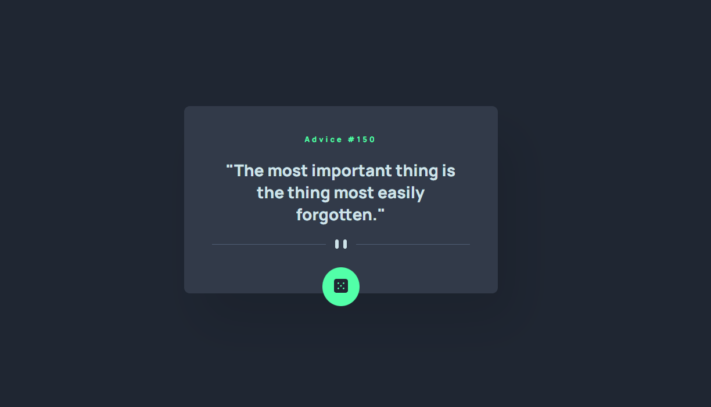
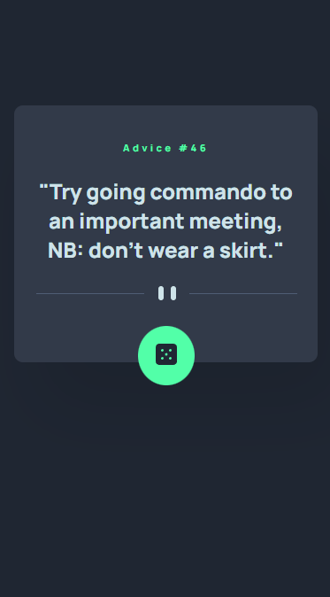

# Frontend Mentor - Advice generator app solution

This is a solution to the [Advice generator app challenge on Frontend Mentor](https://www.frontendmentor.io/challenges/advice-generator-app-QdUG-13db). Frontend Mentor challenges help you improve your coding skills by building realistic projects.

## Table of contents

- [Overview](#overview)
  - [The challenge](#the-challenge)
  - [Screenshot](#screenshot)
  - [Links](#links)
- [My process](#my-process)
  - [Built with](#built-with)
  - [What I learned](#what-i-learned)
  - [Continued development](#continued-development)
- [Author](#author)

## Overview

### The challenge

Users should be able to:

- View the optimal layout for the app depending on their device's screen size
- See hover states for all interactive elements on the page
- Generate a new piece of advice by clicking the dice icon

### Screenshot




### Links

- Solution URL: [Github Repo](https://github.com/KarolisGaiv/Advice-generator)
- Live Site URL: [Check it out live!](https://karolisgaiv.github.io/Advice-generator/)

## My process

### Built with

- Semantic HTML5 markup
- SCSS
- BEM
- Flexbox
- Mobile-first workflow
- [React](https://reactjs.org/) - JS library

### What I learned

Most challenging part of this project was to find a solution how to render a bottom divider line based on current screen with. I've learned that there is a event listener "resize" which listens for window size changes.

```js
// Render divider line based on current screen with
useEffect(() => {
  window.addEventListener('resize', getScreenWidth);
}, [screenWidth]);
```

### Continued development

My further plans would be to improve date fetching and state management skills.

## Author

- Github - [Karolis G](https://github.com/KarolisGaiv)
- Frontend Mentor - [@KarolisGaiv](https://www.frontendmentor.io/profile/KarolisGaiv)
